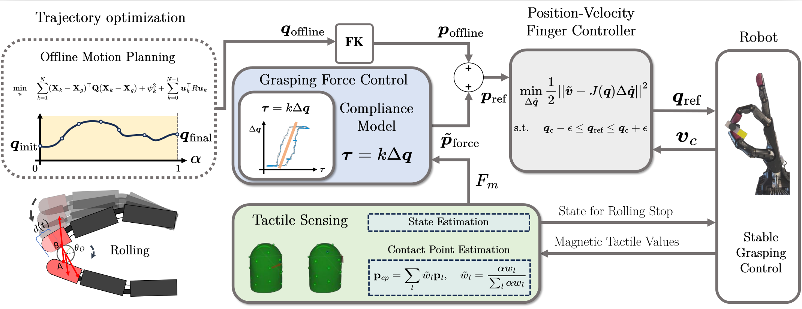
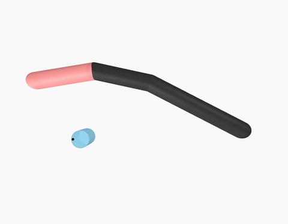

# Trajectory Optimization for In-Hand Manipulation with Tactile Force Control [IROS2025]

Official Code Repository for Trajectory Optimization for In-Hand Manipulation with Tactile Force Control.  
Minimal, **uv**-managed Python project for **in-hand rolling trajectory optimization** (CasADi + IPOPT) with a **MeshCat** visualizer.

[Haegu Lee](https://benthebear93.github.io/)<sup>1</sup>, [Yitaek Kim](https://robotemperor.github.io/)<sup>1</sup>, [Victor Melbye Staven](https://github.com/vmstavens)<sup>1</sup>, Christoffer Slot<sup>1</sup>

<sup>1</sup>University of Southern Denmark 

<p align="center">
    <a href='https://arxiv.org/abs/2503.08222'>
      
    </a>
    <a href='https://arxiv.org/pdf/2503.08222'>
      
    </a>
    <!-- <a href='https://github.com/benthebear93/rolling_trajectory_optimization'>
      
    </a> -->
</p>
<div align="center">
  
</div>

This repo contains:
- `finger.py` – planar finger + circular object model (CasADi)
- `main.py` – builds/solves the NLP and saves `finger_solution.npz`
- `animate.py` – MeshCat animation of the saved trajectory
- `README.md` – this file

---

## Requirements

- Python **3.10 – 3.12**
- [`uv`](https://docs.astral.sh/uv/) (dependency manager)
- A CasADi build with IPOPT (standard wheels typically include it)

---

## Install with uv

```bash
# 1) Create a virtual environment (managed by uv)
uv venv --python 3.12

# 2) Install dependencies from pyproject.toml (creates/updates lockfile)
uv lock
uv sync
```

## How to run

Run the top-level scripts directly (no console entry points, by design):
```bash
# Optimize and save results to finger_solution.npz
uv run python main.py

# Visualize the saved result in MeshCat
uv run python animate.py
```
The result should look like this.
<div align="center">
  
</div>

## Repository Structure
```bash
rolling_trajectory_optimization
├── animate.py
├── editorconfig
├── finger.py
├── finger_rolling.gif
├── finger_solution.npz
├── gitignore
├── main.py
├── pyproject.toml
├── README.md
└── uv.lock
```
## Citation

If you find our codes useful in your work, please cite [our paper](https://arxiv.org/abs/2503.08222):

```
@article{lee2025trajectory,
  title={Trajectory Optimization for In-Hand Manipulation with Tactile Force Control},
  author={Lee, Haegu and Kim, Yitaek and Staven, Victor Melbye and Sloth, Christoffer},
  journal={arXiv preprint arXiv:2503.08222},
  year={2025}
}
```

## Contact

If you have any questions, feel free to contact me through email ([haeg@mmmi.sdu.dk](mailto:haeg@mmmi.sdu.dk))!